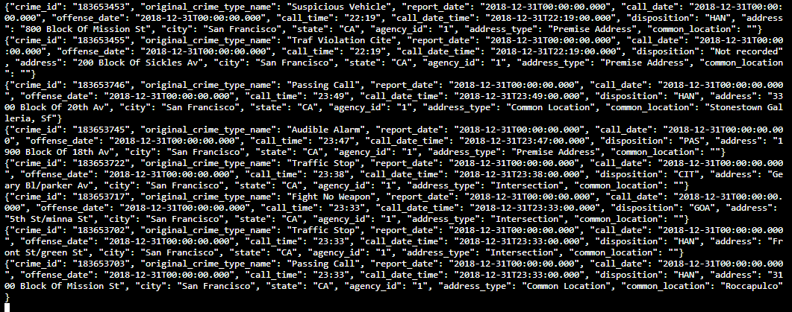
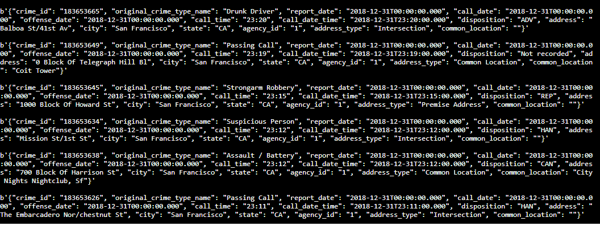

### SF Crime Statistics with Spark Streaming

Environment : Udacity Workspace

Packages required:
* findspark
* pyspark
* python-dateutil
* pathlib

#### Steps to Execute :

1. Start the server:
    Run `/usr/bin/zookeeper-server-start zookeeper.properties` on a sepereate terminal to start zookeeper with specified properties under config
    Run `/usr/bin/kafka-server-start server.properties` on a sepereate terminal to start server with specified properties under config

2. Install packages:
   Above packages are present in requirements.txt and can be installed by running `./start.sh` 

3. Run producer:
   To run producer run `python kafka_server.py`
   
4. Check if data is produced with kafka-console-consumer
   Run `kafka-console-consumer --bootstrap-server localhost:9092 --topic police.service.calls --from-beginning`
   
   Output looks like this:
   

5. Run consumer (NOTE : Apache Spark already has an integration with Kafka brokers, so we would not normally need a separate Kafka consumer):
   To run producer run `python consumer_server.py`
   
   Output looks like this:
   

6. Run Streaming Application:
   To execute `data_stream.py` run `spark-submit --packages org.apache.spark:spark-sql-kafka-0-10_2.11:2.3.4 --master local[*] data_stream.py`
   
   Spark UI while executing looks like this:
   

Answers to Udacity's Questions :

1. How did changing values on the SparkSession property parameters affect the throughput and latency of the data?

    spark.executor.memory : setting executor memory 
    spark.executor.cores : setting executor cores
    spark.driver.memory : setting driver memory
    numInputRecords : The number of records processed in a trigger
    inputRowsPerSecond : The rate of data arriving
    processedRowsPerSecond : The rate at which Spark is processing data
    

2. What were the 2-3 most efficient SparkSession property key/value pairs? Through testing multiple variations on values, how can you tell these were the most optimal? 

    spark.default.parallelism : 3
    spark.streaming.kafka.maxRatePerPartition : 10